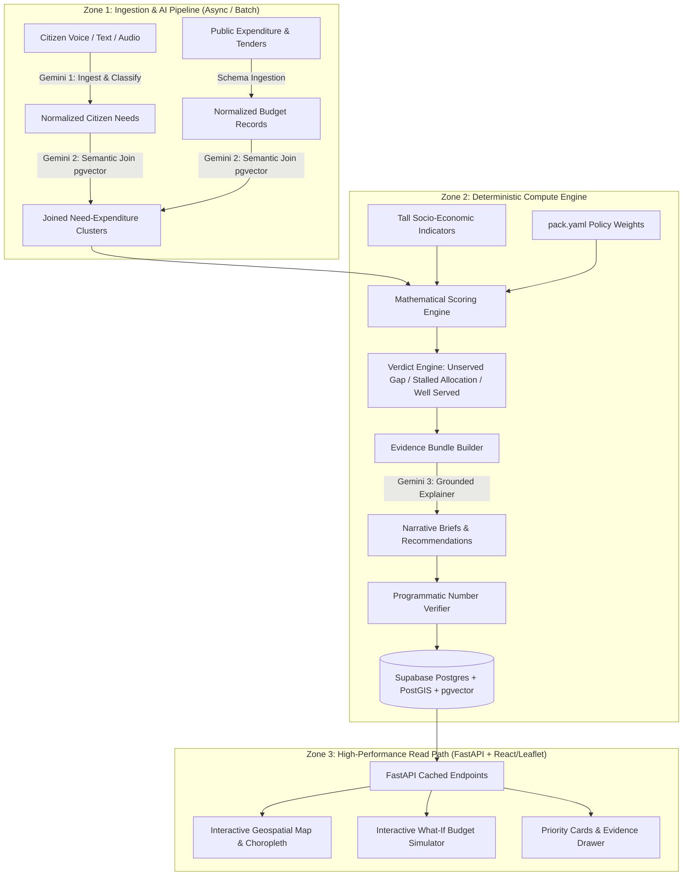

# Implementation Plan — Sangam: Multilingual Digital Public Good for Evidence-Backed Infrastructure Prioritization

Sangam joins **unstructured multilingual citizen voice** (complaints, voice notes, community reports) with **structured public expenditure records** (budgets, sanctions, tenders) to surface **Unserved Gaps** (high citizen demand, zero budget) and **Stalled Allocations** (budget allocated, problem persists).

---

## Status Note — Reconciled Against Running Code, 22 Aug 2026

This plan was written before most of Phases 1–8 were implemented. It has
since been checked line-by-line against the actual codebase and corrected
where reality diverged. Three things changed since the original draft:

1. **The pack-format fork is resolved.** `packs/india_karnataka/pack.yaml`
   is the schema of record for config (languages, sectors, scoring
   weights). `packs/india/` supplies real Jal Jeevan Mission + Local
   Government Directory data, imported into `admin_regions` and
   `indicators` via `backend/app/utils/load_real_data.py` (idempotent,
   matched on `external_id`).
2. **`engine/` has been removed.** It duplicated `backend/`'s role and was
   never imported by anything running — confirmed by grep, and
   independently flagged by a knowledge-graph pass over the repo as
   suspiciously similar to `backend/`.
3. **A citizen-facing ingest endpoint exists, but is incomplete.**
   `POST /api/v1/ingest/citizen` (in `backend/app/routes/priorities.py`)
   accepts text, calls Gemini, and persists a `CitizenReport`. It does
   **not**: accept audio, populate `reporter_hash`, resolve a place name to
   a region, or return a citizen-friendly tracking code — and it stores
   `raw_text` verbatim rather than only the redacted text. **Phase 9**
   below completes it.

Phase 9 and Phase 10 are new, added below Phase 8. Section 6 documents two
places where the running code has deliberately diverged from this plan's
original description, so the plan stops silently disagreeing with the code.

## Status Note — Phase 9 & 10 Verified Against a Real Database, 22 Aug 2026

Everything above was re-verified end to end against a real local PostgreSQL 18
install (PostGIS 3.6.2, pgvector 0.8.6) with a real Gemini API key -- not
mocks. Real Karnataka data imported cleanly, `resolve_location` correctly
matched "Bangalore" -> Bengaluru Urban and "Gulbarga" -> Kalaburagi against
real government data, a real citizen report ("no electricity in Hiriyur")
went through real Gemini extraction, resolved to the real Hiriyur block, and
produced a correctly-suppressed priority (one reporter, below the floor).
Real verdicts (`STALLED_ALLOCATION`, `UNSERVED_GAP`) fired correctly once
demo data was scaled to clear the aggregation floor. Bugs this surfaced that
no mocked test could have caught, all now fixed:

- `AdminRegion` was missing the `external_id` column entirely --
  `load_real_data.py` had never actually run successfully.
- `clustering_engine.py`'s spatial query only looked at
  `citizen_reports WHERE location IS NOT NULL`. Any report resolved via the
  Phase 9.3 gazetteer path (a place name, no GPS -- the normal case for a
  real Telegram/WhatsApp message) never entered clustering at all and would
  silently never reach the dashboard. Fixed: reports with a resolved
  `region_id` and no GPS point are now grouped by `(region_id, sector)` --
  the same key already used for expenditure matching -- into their own
  cluster.
- `CountryPack` (`pack_loader.py`) never declared a `min_distinct_reporters`
  field, so `scoring_engine.py`'s pack-override for the privacy floor was
  silently inert regardless of `pack.yaml`.
- `db_seed.py` had no guard against deleting real citizen data; it now
  refuses to run if any `citizen_reports` row has a real `tracking_id`,
  unless `FORCE_RESEED=true` is set explicitly.

Three items remain genuinely unbuilt, listed below as Phase 11 (WhatsApp),
Phase 12 (cross-lingual semantic clustering), and an open design decision on
the no-expenditure-data verdict path (Section 7) that needs your sign-off
before any code gets written against it.

---

## 1. Architectural Foundations & Load-Bearing Decisions

Sangam is built around 5 non-negotiable architectural principles:
1. **Tall `indicators` Schema with Materialized Views**: Socio-economic indicators are stored tall `(region_id, indicator_code, value, year)` to enable dynamic country packs without schema migrations. For high-performance reads, these are flattened into PostgreSQL Materialized Views.
2. **Configuration-Driven Weights (`pack.yaml`)**: Priority weights (Equity vs. Reach vs. Demand vs. Expenditure Gap) live in country packs, letting ministries adjust policy trade-offs without modifying code.
3. **Model-Free Deterministic Scoring**: Gemini is never allowed to rank priorities. Priorities are ranked using transparent, reproducible mathematical formulas; Gemini generates grounded narrative explanations.
4. **Closed Evidence Bundle Verification**: AI-generated figures and claims are programmatically validated against an immutable JSON evidence bundle. Any discrepancy rejects the summary.
5. **Decoupled Dashboard Read Path**: Zero Gemini API calls on the public dashboard view. Analytics, priority rankings, and AI summaries are precomputed and cached in PostgreSQL/Supabase to prevent rate limit failures during live usage.
6. **Every Analysis Run Is Versioned**: `process_and_prioritize()` never deletes existing results before recomputing. Each run writes under a new `analysis_runs.id` and is marked `complete` only once every step succeeds; read endpoints serve the latest **complete** run. A crash mid-run leaves yesterday's dashboard intact instead of showing nothing — see Phase 9.2, which closes a real gap: the running pipeline currently does delete-then-recompute.



---

## 2. Target Data Model

**8 tables as originally planned, plus 2 added by Phase 9** (`analysis_runs`, `pending_intake`) to close the reliability and single-follow-up-question gaps described below. Columns marked **(added)** exist in the running schema now but were not in the original plan; columns marked **(Phase 9)** are planned, not yet built.

1. **`admin_regions`**: Hierarchical administrative geography (Country -> State/Province -> District -> Ward/Sub-district) with PostGIS geometries (`geom`, nullable — no boundary polygons exist yet for Karnataka blocks; see Phase 9.3). **(added)** `external_id` (the source pack's `unit_id`, e.g. `IN-KA-CHITRADURGA-HIRIYUR`, so `load_real_data.py` can re-import idempotently), `population` (a household-count proxy where true headcount isn't published — see the comment in `real_data_mapping.households_to_population_estimate`). **(Phase 9.3)** `name_variants` (pipe-separated alternate spellings/scripts, e.g. `Bangalore|Bengaluru|ಬೆಂಗಳೂರು` — present in `packs/india/admin_units.csv` today but currently dropped by the importer).
2. **`citizen_reports`**: Raw and normalized citizen submissions (multilingual text/audio, transcription, detected language, sentiment, urgency, extracted sector/category, PostGIS point location). **(added)** `reporter_hash` (HMAC of channel identity + server pepper — column exists, not yet populated by the live ingest endpoint). **(Phase 9.1)** `tracking_id` (short human code returned to the citizen — the trust loop), `channel` (`telegram` | `whatsapp` | `web`). **(Phase 9.3)** `region_id` (FK to `admin_regions`, set by gazetteer resolution at ingest time — the primary location path once real voice input exists; the existing lat/lon `location` point remains a fallback for reports that do carry GPS).
3. **`expenditures`**: Public budget allocations, sanctioned projects, tenders, execution status, amount, department, fiscal year, geographic mapping. **Known divergence for India — see Section 6.**
4. **`indicators` (Tall Table)**: Region-level demographic and socio-economic metrics (`region_id`, `indicator_key`, `numeric_value`, `source_year`). **(added)** `source_name`, `source_url` — a figure that cannot say where it came from should not be treated as evidence.
5. **`issue_clusters`**: Geo-spatial and semantic clusters grouping related citizen reports with associated expenditure line items. **(Phase 9.2)** `run_id` (FK to `analysis_runs`).
6. **`priorities`**: Computed deterministic priority rank, index score, verdict classification (`UNSERVED_GAP`, `STALLED_ALLOCATION`, `UNDERFUNDED_CRITICAL`, `WELL_SERVED`), and formula component breakdowns. **(Phase 9.2)** `run_id`. **(Phase 10)** `list` (`fund` | `audit` — a recommendation for money never allocated and a finding that money was spent but nothing changed are different actions and should not compete on one ranking; see `docs/DECISIONS.md` #8b).
7. **`evidence_bundles`**: Immutable JSON snapshot of ground-truth counts, expenditure amounts, citizen quotes, and indicators used for auditability. **(Phase 9.2)** `run_id`.
8. **`narrative_briefs`**: Gemini-generated, verified policy explanations, root cause analyses, and action recommendations tied to evidence bundles. **(Phase 9.2)** `run_id`.
9. **`analysis_runs`** — **new, Phase 9.2**: `id`, `status` (`running` | `complete` | `failed`), `started_at`, `completed_at`, `note`. Every clustering pass writes under one of these; read endpoints filter to the latest `status="complete"` row.
10. **`pending_intake`** — **new, Phase 9.1/9.3**: `channel_user_hash` (primary key), `channel`, `partial_report` (JSON — whatever Gemini already extracted), `awaiting` (currently always `"location"`), `expires_at` (1 hour). Backs the single-follow-up-question decision: if a citizen names no place, the bot asks exactly one question and never a second.

---

## 3. The 3-Call AI Pipeline & Verification Contract

- **Call 1 (Citizen Ingestion & Normalization)**:
  - Model: `gemini-3.5-flash-lite` (verified against the live API — `gemini-2.5-flash` / `gemini-1.5-pro` from the original draft are retired; `gemini-3.6-flash` returns 503 "high demand" reliably on the free tier, while flash-lite answers the same schema-locked extraction in ~1.2s. Availability beats capability when a demo is live.)
  - Input: Raw voice audio (OGG/Opus — what Telegram and WhatsApp actually send, accepted with no transcoding) or text in any local language. **(Phase 9.1)** the live endpoint today accepts text only; `gemini_service.analyze_citizen_report` needs an audio-accepting variant.
  - Output: Strict JSON schema `{ original_language, english_translation, sector, specific_issue, urgency_score, sentiment, extracted_location_entities, pii_redacted_text }`. **(Phase 9.3 adds)** `location_text_latin` — the same place name romanised into the spelling a government dataset would use, which is what the location resolver matches against; matching the original Kannada/Hindi script directly is unreliable because gazetteer coverage in-script is incomplete.
- **Call 2 (Semantic Join & Entity Resolution)** — **implemented differently from this description; see Section 6.** The running `clustering_engine.py` matches citizen demand to expenditure records by exact `region_id + sector`, not vector/keyword hybrid search. Embeddings are computed and stored on both `citizen_reports` and `expenditures` but not currently queried for matching.
- **Call 3 (Grounded Policy Brief Synthesis)**:
  - Model: `gemini-2.5-flash` with structured system prompt & temperature `0.1`
  - Input: Verified Evidence Bundle JSON only (no external data).
  - Output: Executive summary, why this is prioritized, fiscal gap analysis, recommended action.
- **Programmatic Verifier (Non-LLM)**:
  - An intelligent parser (handling formats like "1.5 million" vs "1,500,000" and currency symbols) extracts all numerical values from Call 3 output and asserts that every number exists in the Evidence Bundle within tolerance. If verification fails, the brief is rejected and regenerated.

---

## 4. Phased Implementation Roadmap

### Phase 1: Foundation, Workspace & Project Setup
- Establish clean monorepo structure:
  - `backend/`: FastAPI application, database connections, Pydantic schemas, Alembic migrations.
  - `frontend/`: Vite + React + TypeScript + TailwindCSS / Modern Design System.
  - `packs/`: Country pack registry starting with `india_karnataka` and `default` template.
  - `scripts/`: Data ingestion seeders and evaluation scripts.
- Set up Supabase / PostgreSQL schema with PostGIS and pgvector extensions.
- Configure environment definitions (`GEMINI_API_KEY`, `SUPABASE_DB_URL`, etc.).

### Phase 2: Core Data Schema & Country Pack Engine
- Implement 8 core database tables via SQL migrations and SQLAlchemy models.
- Create PostgreSQL Materialized Views to flatten the `indicators` tall table for high-performance frontend queries.
- Build Country Pack Loader (`pack.yaml` parser) handling:
  - Administrative boundary hierarchies.
  - Localization dictionaries and language codes.
  - Sector taxonomies (Water, Roads, Sanitation, Health, Education, Electricity).
  - Configurable priority formula weights (e.g. `w_demand`, `w_vulnerability`, `w_expenditure_gap`, `w_urgency`).
- Seed initial geo-spatial administrative boundaries and demographic indicators.

### Phase 3: AI Ingestion & Semantic Join Pipeline
- Build Gemini Audio/Text Multilingual Ingestion Worker (Call 1) with PII redaction.
- Implement PostGIS spatial clustering (ST_ClusterDBSCAN) + pgvector semantic clustering to create `issue_clusters`.
- Build the Expenditure Matching & Semantic Join Engine (Call 2).
- Create batch pipeline and seed realistic multilingual datasets (audio + text) and public expenditure records.

### Phase 4: Deterministic Scoring, Verdict Engine & Budget Simulation
- Implement the model-free deterministic priority scoring formula:
  $$\text{PriorityScore} = w_d \cdot \bar{D} + w_v \cdot V + w_g \cdot G + w_u \cdot U$$
  where $D$ is citizen demand density, $V$ is socio-economic vulnerability index, $G$ is expenditure gap ratio, and $U$ is citizen urgency.
- Implement Verdict Engine:
  - **Unserved Gap**: $\text{Demand} > \theta_d \land \text{AllocatedBudget} = 0$
  - **Stalled Allocation**: $\text{AllocatedBudget} > 0 \land \text{Demand} > \theta_d \land \text{ProjectAge} > \tau$
  - **Underfunded Critical**: $\text{AllocatedBudget} < \text{EstimatedCost} \times 0.3 \land \text{Urgency} = \text{High}$
- Build the Interactive Budget Simulation Engine:
  - Simulates allocating budget \$X to maximize priority resolution, showing trade-offs between equity and population reach.

### Phase 5: Grounded Narrative Generator & Verification Engine
- Build Evidence Bundle Generator (compiling exact counts, budget numbers, and quotes into immutable JSON).
- Implement Gemini Call 3 for executive policy briefs with strict JSON/Markdown schema.
- Implement the Programmatic Number Verifier to ensure zero hallucinations.
- Build pre-computation pipeline that writes all ready-to-serve analytics to the read-store.

### Phase 6: FastAPI Backend API Layer
- Endpoints:
  - `GET /api/v1/overview`: National/regional high-level KPIs (Total unserved gaps, total stalled capital, citizen reports).
  - `GET /api/v1/regions`: PostGIS GeoJSON endpoints with choropleth metrics.
  - `GET /api/v1/priorities`: Filterable priority ranking table with sector, verdict, and region filters.
  - `GET /api/v1/priorities/{id}`: Detailed priority view with evidence bundle, narrative brief, citizen soundbites, and budget audit trail.
  - `POST /api/v1/simulate`: Real-time budget simulation endpoint.
  - `POST /api/v1/ingest/citizen`: Citizen voice/text submission endpoint with real-time audio processing.
  - `GET /api/v1/packs`: List available country packs and active configuration.

### Phase 7: Interactive High-Aesthetic Frontend Dashboard
- Modern, responsive React + TypeScript dashboard with glassmorphic, accessible government-grade design:
  - **Global & Regional Map View**: Leaflet choropleths showing vulnerability, demand density, and stalled capital hotspots.
  - **"The Join" Split Explorer**: Side-by-side comparative visualization of Citizen Demand vs. Government Expenditure.
  - **Verdicts & Priority Matrix**: Interactive table with badge indicators (`Unserved Gap`, `Stalled Allocation`).
  - **Evidence Drawer & Policy Brief Modal**: Deep-dive inspection showing raw citizen voice quotes, expenditure breakdown, and verified Gemini brief.
  - **What-If Budget Simulator Tool**: Interactive slider to allocate simulated funds and see live impact on resolving unserved gaps.
  - **Multilingual Citizen Voice Portal**: Public-facing submission widget allowing citizens to record voice in native language or submit text.

### Phase 8: Testing, Hardening & Demonstration Packaging
- Automated unit and integration tests (scoring algorithm correctness, verifier unit tests, API tests).
- Demo seed datasets with realistic scenarios (e.g. Karnataka water supply unserved gap, stalled road asphalt tenders, rural health clinic).
- Dockerfile, docker-compose, and deployment guides for Railway/Vercel.

### Phase 9: Citizen Intake Completion, Run Reliability & Location Resolution

The dashboard, scoring engine, and verifier are built and correct. What is missing is the path from a real citizen's voice to a database row, and the guarantee that a crash mid-analysis never blanks the dashboard judges are looking at. The three sub-phases below are ordered by dependency: **9.2 has none and can start immediately; 9.1 is the prerequisite for demoing anything live; 9.3 only matters once 9.1 can actually receive a place name that isn't already a lat/lon pair.**

#### 9.1 — Complete the ingestion endpoint; add a Telegram adapter

**Why**: `POST /api/v1/ingest/citizen` exists but is text-only, never populates `reporter_hash` (so every citizen who reports through it silently falls out of the distinct-reporter flood defence in `scoring_engine.py`), stores `raw_text` verbatim rather than only the PII-redacted text, and returns a raw sequential `report_id` instead of a tracking code a citizen can hold onto. There is no channel adapter of any kind — Telegram, WhatsApp, and the brief's own "messaging apps" requirement are entirely unbuilt. Without this sub-phase, Sangam has no way for a real citizen to submit anything; every demo would be a dashboard over hand-seeded data.

**Data model**: add to `citizen_reports` — `tracking_id` (short code, unique, e.g. `SNG-4K2P`, distinct from the DB primary key so a citizen can never infer report volume or order from their own code), `channel` (`telegram` | `whatsapp` | `web`). Stop persisting `raw_text` once PII redaction succeeds; keep it only as an explicit, loudly-logged fallback if redaction itself fails.

**New files**:
- `backend/app/utils/hashing.py` — `hash_channel_user(channel_user_id: str) -> str`, HMAC-SHA256 with a `REPORTER_HASH_PEPPER` setting (new required env var, generated once with `python -c "import secrets; print(secrets.token_hex(32))"`, never committed).
- `backend/app/utils/tracking_id.py` — short, human-typeable code generator.
- `backend/app/services/telegram_adapter.py` — verifies a Telegram update, extracts `chat_id` + text or a voice `file_id`, downloads voice via Telegram's `getFile`, calls the shared ingestion function below, replies via `sendMessage` with the tracking id (and, if no location was found, the one follow-up question from `pending_intake` — see 9.3).
- `backend/app/routes/webhooks.py` — `POST /api/v1/webhooks/telegram`, thin: parse the payload, hand off to `telegram_adapter`, return 200 immediately (Telegram retries on non-200 or slow responses).

**Changed files**:
- `backend/app/services/gemini_service.py` — extend `analyze_citizen_report` to accept audio bytes + mime type as an alternative to `text_content` (the multimodal approach this project already proved works, in an earlier throwaway script now removed with `engine/` — properly homed in the service layer this time). Add `location_text_latin` to `CitizenReportAnalysis` (Phase 9.3 depends on this field existing).
- `backend/app/routes/priorities.py` — pull `ingest_citizen_report`'s body out into a shared `ingest_citizen_message()` function in a new `backend/app/services/ingestion_service.py`, so the REST endpoint and the Telegram adapter call identical logic instead of duplicating it. Set `reporter_hash`, `channel`, `tracking_id` on every created report. Return `CitizenIngestResponse` via `response_model=` instead of a raw dict.
- `backend/app/schemas/__init__.py` — `CitizenIngestResponse` gains `tracking_id: str`.

**New route**: `GET /api/v1/citizens/{tracking_id}` — the trust loop. A citizen who cannot check whether they were heard stops reporting, and a system with no incoming data has nothing to analyse.

**Build order**: hashing + tracking-id utilities (no dependencies) → extend `ingest_citizen_report` in place to use them (provable against the existing text-only path first) → pull the logic into `ingestion_service.py` → add the audio-accepting Gemini call → build the Telegram adapter and webhook route on top of the now-shared service → `GET /citizens/{tracking_id}`.

**Verification**: unit tests for `hash_channel_user` (same input → same hash, different input → different hash, output never reversible) and tracking-id generation (uniqueness, no report-id leak); an integration test posting text through `/ingest/citizen` asserting `reporter_hash`/`tracking_id`/`channel` are all populated; a manual test sending a real Telegram voice note and confirming the reply carries a tracking id.

#### 9.2 — Version every analysis run

**Why**: `process_and_prioritize()` opens by deleting every existing `Priority`, `EvidenceBundle`, `NarrativeBrief`, and `IssueCluster`, then recomputes in the same pass. If a Gemini call inside that pass fails — a real possibility given free-tier 503s during a live demo — the dashboard is left showing nothing rather than yesterday's complete results. This is the exact failure mode "degrade, never fail" (principle 6, Section 1) exists to prevent, and it is not hypothetical: it is what the running code does today.

**Data model**: new `analysis_runs` table (Section 2, item 9). Add `run_id` (FK to `analysis_runs`) to `issue_clusters`, `priorities`, `evidence_bundles`, `narrative_briefs`.

**Changed files**:
- `backend/app/services/clustering_engine.py` — remove the four `.delete()` calls at the top of `process_and_prioritize()`. At the start, create `AnalysisRun(status="running")`, commit, capture `run.id`, and stamp every row created during the pass with it. On success, set `status="complete"`, `completed_at=now()`. On any exception, set `status="failed"` in the `except` block before re-raising, rather than leaving the row stuck at `"running"` forever.
- New `backend/app/services/run_service.py` — `get_latest_complete_run_id(db) -> int | None`, the one place this lookup lives.
- Every read route currently querying `IssueCluster`/`Priority` directly (`overview.py`, `priorities.py`, `clusters.py`, `reports.py`) — filter by `get_latest_complete_run_id(db)`. If it returns `None` (no completed run yet), return an explicit "no analysis has completed yet" response rather than an empty list that reads as "nothing to report."

**Build order**: `AnalysisRun` model and `run_service.py` have no dependents and can be built and tested standalone first; then wire `clustering_engine.py`; only then touch the read routes, one at a time, each independently testable.

**Verification**: a test that runs `process_and_prioritize()` twice in a row and asserts the second run's rows never reference the first run's `run_id`; a test that forces an exception mid-run (mock a Gemini call to raise) and asserts the *previous* complete run's data is still what every read route returns; a test asserting a route returns the explicit no-data-yet response when `analysis_runs` is empty.

#### 9.3 — Location resolution (gazetteer, not geocoding)

**Why**: `citizen_reports.location` is a raw lat/lon point with no path to get there from a citizen saying "Hiriyur, Chitradurga" — the entire reason this project doesn't use Google's Geocoding API is that it needs a billing account this project doesn't have. `packs/india/admin_units.csv` already carries `name_variants` for exactly this purpose (alternate spellings, Kannada script, pre-2014 district names like "Gulbarga" for "Kalaburagi") but `real_data_mapping.map_admin_unit_row` currently drops that column on import.

**Data model**: add `name_variants` (`Text`, pipe-separated, matching the CSV's own format) to `admin_regions`. Add `region_id` (FK to `admin_regions`) to `citizen_reports` — the primary location path for real data, since no boundary polygons exist yet to support the spatial nearest-ward query `clustering_engine.py` already has for lat/lon points.

**Changed files**:
- `backend/app/utils/real_data_mapping.py` — `map_admin_unit_row` gains `name_variants` in its returned dict (already present in the source CSV, simply not read today).
- `backend/app/utils/load_real_data.py` — pass `name_variants` through on create/update.

**New file**:
- `backend/app/services/location_resolver.py` — `resolve_location(location_text_latin: str, country_code: str, db: Session) -> AdminRegion | None`. Loads every region's `name` + `name_variants` for the country into memory (259 rows for Karnataka — trivial), tries an exact case-insensitive match first, then a fuzzy match (`rapidfuzz`, new dependency — small, no service to run) against the same pool. Deliberately in Python rather than Postgres `pg_trgm`: `pg_trgm` isn't enabled in `db_init.py` yet, and at this row count in-memory fuzzy matching is fast enough that adding a third Postgres extension isn't worth the risk this close to a deadline.

**Wire into ingestion**: in `ingestion_service.ingest_citizen_message` (built in 9.1), after Gemini Call 1 returns `location_text_latin`, call `resolve_location()`. If it resolves, set `citizen_reports.region_id` directly — no spatial query needed. If it does not resolve and the report has no lat/lon either, write a `pending_intake` row and have the channel adapter ask the one follow-up question; if the citizen never answers within the hour, the report stays unresolved, excluded from clustering, and counted in an explicit "unresolved" figure on the dashboard rather than silently dropped.

**Changed**: `clustering_engine.py`'s region-attribution step (already fixed to do a real `ST_Contains`/`ST_Distance` spatial query instead of always picking the first ward) should now *prefer* `citizen_reports.region_id` when the resolver already set it, and only fall back to the spatial query for reports that arrived with a raw GPS point and no resolvable place name.

**Build order**: fix `name_variants` in the importer first (small, testable against the real CSV with no other dependency) → `location_resolver.py` as a pure function taking a list of regions + a query string, testable without a live database using fixture data → wire it behind a live DB session → integrate into `ingestion_service` → update `clustering_engine.py`'s preference order last, since it touches already-fixed code.

**Verification**: unit tests for `resolve_location` against a small fixed region fixture covering exact match, a known alternate spelling ("Bangalore" → Bengaluru Urban), a pre-2014 name ("Gulbarga" → Kalaburagi), and a genuinely unresolvable string (returns `None`, never guesses); an end-to-end test posting a citizen report whose text names a real Karnataka block and asserting `region_id` resolves to the correct row; a test confirming an unresolvable location produces a `pending_intake` row rather than a silently null region.

### Phase 10: Secondary Gaps

Lower urgency than Phase 9 — each is a real, agreed decision with no implementation yet, but none blocks a demo the way Phase 9's items do.

- **Two-list split** (`docs/DECISIONS.md` #8b): add `priorities.list` (`fund` | `audit`). A cluster where `allocated_budget == 0` competes on the `fund` list; a cluster where `stalled_status` is true routes to `audit` instead of competing on `fund` — money-was-never-allocated and money-was-spent-but-nothing-changed are different actions for a policymaker and should not be ranked against each other.
- **Aggregation floor enforced at the API boundary**: `scoring_engine.py` already computes `suppressed` (fewer than `min_distinct_reporters`, a privacy floor so a two-person village cluster can't identify its own complainants) but no read route checks it before returning results. `routes/priorities.py` and `routes/clusters.py` need to drop or mask `suppressed=True` rows before they reach the frontend.

**Status: done.** Both routes drop suppressed rows/records entirely (list
endpoints omit them, detail endpoints 404) rather than partially masking
fields, and `priorities.list` is now a real column set once at analysis
time in `clustering_engine.py`, not recomputed per request.

### Phase 11: WhatsApp Channel Adapter (Twilio Sandbox)

**Why**: `docs/DECISIONS.md #15` and the original brief both call for WhatsApp
alongside Telegram ("Twilio sandbox only. Join code + QR on a slide"). Only
Telegram exists today (Phase 9.1). This is a genuinely new build, not a bug
fix -- unlike Telegram's Bot API, Twilio's webhook sends
`application/x-www-form-urlencoded` form data, not JSON, and outbound
replies go through Twilio's REST API with Basic Auth rather than a bot
token in the URL path. The actual ingestion call is identical either way --
`ingestion_service.ingest_citizen_message()` already doesn't care which
channel called it.

**New env vars** (add to `backend/.env.example`, never commit real values):
- `TWILIO_ACCOUNT_SID`, `TWILIO_AUTH_TOKEN` -- from the Twilio console.
- `TWILIO_WHATSAPP_FROM` -- the sandbox's own WhatsApp number, formatted
  `whatsapp:+14155238886` (Twilio's well-known sandbox number; a real
  WhatsApp Business number would replace this later, out of scope here).

**New file**:
- `backend/app/services/whatsapp_adapter.py` -- mirrors
  `telegram_adapter.py`'s structure and control flow (pending-intake check
  first, then ingest, then reply) but adapted to Twilio's payload shape:
  - Incoming fields: `From` (`whatsapp:+<E.164 number>`, use this as the
    channel user id -- hash it the same way `chat_id` is hashed today),
    `Body` (text), `NumMedia` (int, as a string), and when `NumMedia > "0"`,
    `MediaUrl0` + `MediaContentType0` for the first attachment (a voice
    note comes through as a normal media attachment, not a separate voice
    field the way Telegram sends it).
  - Downloading media: `MediaUrl0` requires HTTP Basic Auth
    (`TWILIO_ACCOUNT_SID` / `TWILIO_AUTH_TOKEN`) to fetch the actual bytes
    -- unlike Telegram's two-step `getFile` dance, this is a single
    authenticated GET.
  - Sending a reply: `POST https://api.twilio.com/2010-04-01/Accounts/
    {TWILIO_ACCOUNT_SID}/Messages.json` with Basic Auth and form fields
    `From` (`TWILIO_WHATSAPP_FROM`), `To` (echo back the incoming `From`),
    `Body` (the reply text). No two-step file-info lookup like Telegram's
    `sendMessage` needs.
  - Twilio signs every webhook request with an `X-Twilio-Signature` header
    (HMAC-SHA1 over the URL + sorted form params, keyed by
    `TWILIO_AUTH_TOKEN`). Verify it before processing -- unlike Telegram's
    webhook, which has no signature at all today, an unverified WhatsApp
    endpoint accepting form data is a spoofable ingestion path. Reject with
    a 403 on mismatch, still returning quickly either way so Twilio doesn't
    retry-storm a slow endpoint.

**New route**: `POST /api/v1/webhooks/whatsapp` in `backend/app/routes/
webhooks.py`, alongside the existing Telegram route -- same pattern (parse,
hand off, return 200 fast), but Twilio expects the response body to be
either empty or valid TwiML; returning `Response(status_code=200)` with an
empty body is sufficient and simplest.

**Build order**: signature verification as a standalone testable function
first (pure function: URL + params + auth token -> bool, no I/O) → the
adapter's message-parsing logic against fixture Twilio payloads → the media
download + Gemini call, reusing `ingestion_service` unchanged → the webhook
route → outbound reply sending last, since it's the only piece needing a
live Twilio sandbox to fully confirm.

**Verification**: unit tests for the signature verifier (valid signature
passes, tampered params fail, wrong auth token fails); unit tests for
payload parsing against a fixture form-encoded body (with and without
media); an integration test posting a fixture WhatsApp webhook body through
`/api/v1/webhooks/whatsapp` and asserting `ingest_citizen_message` was
called with `channel="whatsapp"`. Manual verification (deferred until
deployment, per team decision) -- join the Twilio sandbox from a real
phone, send a text and a voice note, confirm a reply with a tracking id
arrives, confirm `GET /citizens/{tracking_id}` returns the report.

### Phase 12: Cross-Lingual Semantic Clustering (pgvector)

**Why**: `citizen_reports.embedding` and `expenditures.embedding` are
computed by Gemini and stored on every row (768 dimensions, forced via
`output_dimensionality` -- see `gemini_service.py`) but never queried.
Clustering today (`clustering_engine.py`) is purely spatial -- `ST_ClusterDBSCAN`
on GPS points, plus the `(region_id, sector)` grouping Phase 9.3-and-the-
clustering-bug-fix added for GPS-less reports. Two reports about the same
pothole, one in Kannada and one in Hindi, land in the same cluster today
only if they also share a `region_id` or nearby GPS -- there is no path by
which semantic similarity alone unifies or splits a cluster. This was flagged
as a known, deliberate simplification in Section 6 divergence #1 ("not
scheduled for rework unless a real need for fuzzy expenditure matching
surfaces in testing") -- it's citizen-side clustering, not expenditure
matching, where the real need actually is.

**Design**: pgvector's cosine-distance operator (`<=>`) computes similarity
directly in SQL, so this doesn't need a new service layer -- it extends the
existing clustering pass. Two changes, applied in order:

1. **Split false merges**: within a `(region_id, sector)` or spatial-DBSCAN
   group formed today, a report whose embedding is far (cosine distance
   above a threshold, propose `0.35` as a starting point -- needs tuning
   against real multilingual report pairs, not guessed once and left) from
   that group's centroid embedding is pulled into its own cluster instead.
   This catches "two different problems that happen to be reported from the
   same block" -- e.g. a water complaint and a roads complaint that
   happened to get the same region_id/sector by coincidence of how sectors
   are classified.
2. **Merge true matches across region boundaries**: reports in *different*
   `(region_id, sector)` groups (or different spatial clusters) whose
   embeddings are very close (propose `0.15` cosine distance) get flagged
   as a candidate merge -- e.g. the same road spanning a ward boundary,
   reported by people on each side who got attributed to different wards.
   Do **not** auto-merge across regions silently: a merge changes which
   `AdminRegion` a cluster's evidence and vulnerability index come from,
   which is exactly the kind of number a policy brief cites. Surface merge
   candidates and require them to be confirmed (a new `merge_suggestions`
   table, or an admin-facing endpoint) rather than silently combining two
   regions' worth of evidence into one.

**Changed file**:
- `backend/app/services/clustering_engine.py` -- after the existing
  spatial + gazetteer grouping produces `cluster_map`, add a pass that
  computes each group's centroid embedding (`AVG` over member reports'
  `embedding` column, or `array_agg` + a pgvector aggregate) and applies
  the split/merge-candidate logic above using `<=>` queries against
  `citizen_reports.embedding`.

**New file** (only if merge candidates are pursued, not required for the
split-only half of this phase):
- A `merge_suggestions` table and a review endpoint -- deferred to its own
  design pass once the split logic is proven, since "auto-suggest a merge"
  is a smaller, safer first step than "auto-execute a merge."

**Build order**: the split logic alone (safe, only ever creates more
clusters, never changes which region/evidence a report contributes to) →
prove it against seeded multilingual pairs before touching merge logic at
all → merge-candidate detection as a read-only suggestion, no auto-merge,
as a deliberately separate and later step.

**Verification**: a test seeding two reports with genuinely different
embeddings but the same `region_id`/sector, asserting the split logic
separates them; a test seeding two reports with near-identical embeddings
(e.g. the same English sentence translated two ways) sharing a
`region_id`/sector, asserting they are *not* incorrectly split; a fixed
threshold-tuning note in the test file itself recording what real
similarity scores looked like for a genuine same-issue multilingual pair
during development, since `0.35`/`0.15` above are starting guesses, not
measured values.

---

## 5. Verification Plan

### Automated Tests
- `pytest backend/tests/test_scoring.py`: Mathematical verification of scoring formulas and edge cases (zero budget, zero population, max urgency).
- `pytest backend/tests/test_verifier.py`: Verification that hallucinated numbers in AI briefs are caught and rejected.
- `pytest backend/tests/test_country_pack.py`: Validation of `pack.yaml` loading, schema parsing, and dynamic indicator queries.
- `pytest backend/tests/test_api.py`: FastAPI endpoint status codes, GeoJSON response structures, and simulation calculations.
- `npm run test` / `npm run build`: Frontend TypeScript build and component integrity verification.
- `pytest backend/tests/test_hashing.py` **(Phase 9.1)**: reporter-hash determinism and non-reversibility, tracking-id uniqueness.
- `pytest backend/tests/test_ingestion_service.py` **(Phase 9.1)**: shared ingestion logic populates `reporter_hash`/`channel`/`tracking_id` regardless of which caller (REST route or Telegram adapter) invokes it.
- `pytest backend/tests/test_run_versioning.py` **(Phase 9.2)**: two consecutive runs never mix `run_id`s; a forced mid-run failure leaves the previous complete run's data intact and readable; a route returns the explicit no-data-yet response when `analysis_runs` is empty.
- `pytest backend/tests/test_location_resolver.py` **(Phase 9.3)**: exact match, known alternate spelling, pre-2014 district name, and genuinely unresolvable input, against a small fixed region fixture (no live database required).
- `pytest backend/tests/test_whatsapp_adapter.py` **(Phase 11)**: signature verification (valid, tampered, wrong-token cases), fixture Twilio payload parsing with and without media, `channel="whatsapp"` reaches `ingest_citizen_message`.
- `pytest backend/tests/test_clustering_engine.py` **(Phase 12)**: same-region/sector reports with genuinely different embeddings get split into separate clusters; near-identical embeddings (a same-issue multilingual pair) are not incorrectly split.

### Manual & System Verification
- Voice ingestion test: Submit a recorded audio snippet in Kannada/Hindi/English -> verify Gemini Call 1 produces accurate English translation, sector tagging, and sentiment. **Not currently executable — the live endpoint accepts text only; becomes testable once Phase 9.1's audio-accepting `analyze_citizen_report` variant lands.**
- Telegram end-to-end test **(Phase 9.1)**: send a real voice note to the bot in Kannada or Hindi, confirm the reply carries a tracking id, confirm `GET /citizens/{tracking_id}` returns the report. **Deferred until deployment** — needs a public HTTPS endpoint (e.g. `ngrok`) to receive Telegram's webhook, per team decision.
- WhatsApp end-to-end test **(Phase 11)**: join the Twilio sandbox from a real phone, send a text and a voice note, confirm a reply with a tracking id, confirm `GET /citizens/{tracking_id}` returns the report. **Deferred until deployment**, same reason as Telegram.
- Join verification: Verify that a stalled road repair in Ward X correctly maps to the 2024 municipal road sanction.
- Simulation verification: Verify interactive slider updates affected priority counts in real time.
- Reliability test **(Phase 9.2)**: kill the process mid-`process_and_prioritize()` run (e.g. `SIGKILL` during a batch), restart, confirm the dashboard still shows the previous complete run rather than an empty state.

---

## 6. Known Deferred Divergences from the Original Design

Two places where the running system intentionally does something different from what an earlier version of this plan described. Recorded here so the plan stops silently disagreeing with the code.

1. **The Call 2 semantic join is an exact match, not vector/hybrid search.** `clustering_engine.py` matches citizen demand to expenditure records by `region_id + sector` equality. `citizen_reports.embedding` and `expenditures.embedding` are computed and stored but not queried. This is a reasonable simplification once region and sector are already known — vector similarity earns its keep for *cross-language clustering of citizen requests themselves* (which does use embeddings, correctly), not for a join where both sides already share an exact key. Not scheduled for rework unless a real need for fuzzy expenditure matching surfaces in testing.

2. ~~**India has no district-level sanctioned-budget data, so the `expenditures`-driven verdict model cannot produce a verdict for real Karnataka regions.**~~ **Resolved by Phase 13 (`DELIVERY_GAP`), Section 7 — done, not just planned.** This was discovered, not assumed: government sources publish state-level JJM financial sanctions, never a district or block breakdown. Real Karnataka data instead carries delivery-rate indicators (see `packs/india/indicators.csv`), from which a "this block delivers 77.85% while its own district delivers 88.5%" finding is now a real, computed verdict — see Section 7 for the mechanism and real verification numbers.

---

## 7. Phase 13: Delivery-Rate Verdict Path (`DELIVERY_GAP`)

**Decided 22 Aug 2026: option 1** (of three considered — see git history of
this file for the other two, folding the shortfall into `UNSERVED_GAP`, and
doing nothing). A new verdict, computed from delivery-rate indicators alone,
kept separate from `UNSERVED_GAP` so the system never claims "zero budget
was allocated" when what it actually knows is "no budget data exists for
this region, but coverage looks bad relative to its peers" — those are not
the same claim, and a ministry reading `UNSERVED_GAP` would assume the
stronger one. **Status: done, verified against real government data.**

**The gap this closes**: `scoring_engine.py`'s expenditure-gap term was
`1.0` (maximum) whenever `allocated_budget == 0`, which is *every* real
Karnataka region for *every* sector — no district-level budget data exists
at all (`docs/DECISIONS.md #2`). Every real region's expenditure-gap score
saturated identically, and the `UNSERVED_GAP`/`STALLED_ALLOCATION`
distinction this project is named for could not be told for a single real
region — only the hand-seeded demo data (which has fake `Expenditure` rows)
could ever show it.

**How it works**: `SECTOR_DELIVERY_INDICATOR` (`clustering_engine.py`) maps
a sector to the indicator_key that substitutes for budget data — currently
only `"water": "water.piped_household_pct"`, since real Karnataka data only
carries delivery-rate indicators for water (`docs/DECISIONS.md #1`). When a
region+sector has zero `Expenditure` rows, `scoring_engine.py` compares the
region's own value for that indicator against its parent district's value
for the same key (a direct row lookup — Karnataka's real data already
carries the indicator at both levels, no aggregation needed). A shortfall
of at least `MIN_DELIVERY_GAP` (2.0 points, to avoid firing on noise)
fires `DELIVERY_GAP` instead of `UNSERVED_GAP`, and the expenditure-gap
score becomes the actual normalized shortfall
(`(reference - rate) / reference`) instead of a flat 1.0 — so a 40-point
gap now outranks a 5-point one, where before both scored identically.

**Verified end-to-end against real data, not just tests**: Hiriyur block
(Chitradurga district) has no `Expenditure` rows for water and a real
`water.piped_household_pct` of 77.85 vs. its district's 88.5 — a genuine
10.65-point shortfall. Five real water complaints resolved to Hiriyur
produced `verdict: "DELIVERY_GAP"`, `score: 27.63`,
`expenditure_gap: 0.12` (= 10.65 / 88.5), confirmed both directly in
Postgres and through `GET /api/v1/priorities`. Side by side in the same
API response, the synthetic Indiranagar water cluster (which *does* have a
zero-budget `Expenditure` row) still correctly produced `UNSERVED_GAP` —
proving the two verdicts fire on the right data, not just that the code
runs.

**Changed files**:
- `backend/app/services/scoring_engine.py` — `DELIVERY_GAP` added to
  `VALID_VERDICTS`; `MIN_DELIVERY_GAP` constant; two new optional params,
  `delivery_rate`/`delivery_reference`; expenditure-gap and verdict logic
  both extended (existing behavior for regions with real budget data is
  byte-for-byte unchanged).
- `backend/app/services/clustering_engine.py` — `SECTOR_DELIVERY_INDICATOR`
  mapping; looks up the region's and its parent's indicator value the same
  way the existing `vulnerability_index` lookup already does; passes both
  into `calculate_priority_score`; both values added to the evidence bundle
  so the Gemini brief and verifier can cite them honestly.
- Frontend: `api.ts` (verdict union type), `App.tsx` (filter dropdown),
  `ClusterMap.tsx` (pin color), `PriorityList.tsx` (badge metadata),
  `index.css` (`--verdict-deliverygap`, `.badge-deliverygap`) — a distinct
  violet, so it doesn't collide with the existing four verdict colors.
- `backend/tests/test_scoring_engine.py` — five new tests: fires on a real
  shortfall, doesn't fire with no delivery signal at all (regression
  check), doesn't fire on a sub-threshold noise-level gap, never overrides
  real budget data even when a large delivery gap is also present, and a
  bigger shortfall scores a bigger expenditure_gap than a smaller one.

**Not done, deliberately deferred**: options 2 and 3 are not implemented —
option 1 was chosen outright, not layered on top of the others. Extending
`SECTOR_DELIVERY_INDICATOR` to other sectors is a data problem, not a code
one — it needs a government-published coverage-percentage indicator to
exist for that sector first, which today only water has.

---

## Status Note — Phases 18, 14, 15, 19, 16 Built and Verified Against Real Infrastructure, 23 Aug 2026

Gemini built all five; verified end-to-end against the real local database
and real Gemini calls (not mocks) -- three real bugs found and fixed in
the process, none of which the mocked test suite (165 tests, all passing
throughout) could have caught:

- **`load_real_data.py` never actually populated any centroid.** It keyed
  the centroid lookup by `external_id` (the LGD `unit_id` string, e.g.
  `"IN-KA-CHITRADURGA-HIRIYUR"`) against a dict built from
  `admin_centroids.csv`'s `external_code` column (a different identifier,
  e.g. `"5811"`) -- the two never matched, so every region's `centroid`
  stayed `NULL` regardless of the CSV being correct. Fixed to key off the
  raw CSV row's `external_code` instead. Verified: 173 regions now
  populate correctly, Hiriyur's centroid matches the sourced BigQuery
  coordinate exactly.
- **`GET /api/v1/clusters` 500'd on every single call.** The new
  `"centroid": c.centroid` line returns a GeoAlchemy2 `WKBElement`
  straight from the ORM, which FastAPI's `jsonable_encoder` cannot
  serialize -- this would have broken the map for the entire demo, not
  just the fallback case. Fixed by selecting
  `func.ST_AsText(IssueCluster.centroid)` in the query instead of
  converting client-side (avoids adding a new Shapely dependency this
  late). Verified: real Hiriyur cluster now returns
  `"centroid":"POINT(76.6172 13.9446)"`, `"is_approximate_location":true`,
  `"verdict":"DELIVERY_GAP"` -- the exact real, hand-verified case from
  Phase 13, now visible on the map for the first time all session. One
  test (`test_routes.py::test_suppressed_priority_hidden_from_all_endpoints`)
  had to be updated to match the corrected query shape.
- **Location fuzzy-matching was case-sensitive and silently dropped real
  matches.** Both `location_resolver.py` (the original Phase 9.3 resolver)
  and its inline duplicate in `clustering_engine.py`'s new Phase 18 retry
  pass lowercase the query text but not the candidate region names before
  scoring with `rapidfuzz.fuzz.WRatio` -- "hiriyur market" vs "Hiriyur"
  scores 77 (mixed case) instead of 90 (matched case), landing under the
  85 threshold and silently failing to resolve a real, resolvable
  location. This bug predates this session's changes -- it was already
  live in the original resolver, just never triggered by test fixtures
  that happened to use matching case. Fixed in both places. Confirmed by
  isolated reproduction (score crosses the threshold correctly once both
  sides are lowercased); live end-to-end confirmation was inconclusive
  because Gemini's analysis of identical repeated text was not
  deterministic across retries -- a pre-existing characteristic of the
  Gemini call, not a bug in the fix.

Also verified independently and confirmed correct with no changes needed:
Phase 18's split try/except (Gemini failure still returns a real tracking
ID and persists the report as `status="pending_analysis"`; the retry pass
picks it up on the next run), Phase 19's `partial_evidence` renormalized
weighting (confirmed on real Hiriyur data: `vulnerability: null`,
`weights_applied.vulnerability_index: 0.0`), Phase 15's image path
(a real JPEG posted through `/ingest/citizen` was correctly analyzed by
Gemini's multimodal call), and Phase 16's multipart web portal endpoint
(`CitizenPortal.tsx`, `/report` route, multipart `/ingest/citizen`) --
tested with both text-only and text+image submissions, both succeeded.
Frontend builds cleanly (`tsc -b && vite build`, zero errors).

---

## 8. Phase 14: Region Centroid Coordinates for the Map (bug fix, not a feature)

**Why**: `ClusterMap.tsx` is real, correctly built Leaflet (verified 23 Aug
2026 by reading the component and its wiring into `App.tsx`), and it
already handles verdict colors, sector icons, popups and legend correctly.
But it only plots a cluster whose `centroid` field parses as a WKT
`POINT(...)`. `clustering_engine.py` computes that centroid with
`ST_Centroid` over the member reports' `location` column — and any cluster
formed via the gazetteer path (Phase 9.3: a citizen names a place, e.g.
"Hiriyur", instead of sharing GPS, which is the normal case for a real
Telegram/WhatsApp text or voice message) has every member report's
`location` set to `NULL`, so the centroid comes back `NULL` too. The map
silently drops it. Confirmed there is no fallback available today:
`packs/india/admin_units.csv` has no lat/lon columns at all, and
`admin_regions.geom` (Section 2, item 1) is documented as unpopulated for
Karnataka — no boundary polygons exist. Net effect: only hand-seeded demo
reports that already carry raw GPS ever show a pin. Every real
government-data-backed cluster — the ones that actually prove the join
works — is invisible on the map, even though it is correctly ranked and
scored everywhere else.

**Data model**: add `centroid = Column(Geometry(geometry_type="POINT",
srid=4326), nullable=True)` to `AdminRegion` — a single representative
point per administrative unit, deliberately **not** a boundary polygon
(polygons are a much larger data-sourcing problem and nothing here needs
one; a point is enough to drop a pin). Source the coordinates once,
offline, for only the ~30–60 units actually present in
`packs/india/admin_units.csv` — e.g. from OpenStreetMap Nominatim or
India's LGD portal, looked up by district/block name and pasted into a
static reference file. This is a one-time data-entry task, not a live
geocoding integration, so it doesn't touch `N8` ($0 running cost, no Google
Maps billing).

**New file — done, 23 Aug 2026**: `packs/india/admin_centroids.csv` —
columns `external_code, centroid_lat, centroid_lon`, keyed the same way
`admin_units.csv` already is (`external_code` = LGD code). Populated for
all 30 real districts (sourced from a bulk open-data district-centroid
list cross-checked against `admin_units.csv`'s own district names) plus
**143 of the 228 blocks** — 1 (Hiriyur, sourced manually), 141 via a SQL
query against BigQuery's free public OpenStreetMap dataset
(`bigquery-public-data.geo_openstreetmap.planet_features`, matched by
settlement name within a Karnataka bounding box; 39 of those had more
than one same-named OSM candidate and were resolved automatically by
picking whichever candidate is geographically nearest to that block's own
district centroid — a reasonable heuristic, not verified point-by-point,
so treat block-level pins as good-enough-for-a-demo rather than
survey-grade), and 1 more (Shorapur) via a follow-up query against OSM
administrative-boundary relations for the names the first query missed
(that second query only recovered one — OSM's Karnataka taluk-boundary
coverage is thin outside a few districts). File has 173 data rows (30
districts + 143 blocks) plus a header line. The remaining **85 blocks**
have no entry and rely entirely on the fallback below —
some of these are actually easy-to-know places like district HQs (e.g.
`Koppal`, `Gadag`) that simply didn't carry a matching OSM tag within
either query's filters, not genuinely obscure locations.

**Changed files**:
- `backend/app/utils/load_real_data.py` — after upserting each
  `AdminRegion`, look up its `external_code` in `admin_centroids.csv` (load
  once into a dict, same pattern as the rest of the file) and set
  `region.centroid` via `ST_MakePoint(lon, lat)` if a match exists. Missing
  rows are fine — leave `centroid` `NULL`, handled by the fallback below.
- `backend/app/services/clustering_engine.py` — where `centroid_wkt` comes
  back `NULL` from the `ST_Centroid` query (the existing "Fetch spatial
  centroid" step): first try `region.centroid` (the cluster's own resolved
  region — needs the region lookup reordered to run before this fallback,
  not after, since it currently runs later in the gazetteer path); if
  **that** is also `NULL` (a block with no entry in
  `admin_centroids.csv`), walk up to `region.parent_id` and try its
  centroid instead (every district has one, so this always terminates in
  at most one hop for the current data). This means **a block with no
  block-level coordinate still gets a pin at its district's location**
  rather than vanishing from the map — an honest approximation (the popup
  should say so — see below), not a silent gap.
- `frontend/src/components/ClusterMap.tsx` — when a cluster's marker
  position came from a district-level fallback rather than an exact
  block/GPS point, say so in the popup (e.g. "approximate — district
  centroid") so a policymaker isn't misled into reading precision that
  isn't there. Requires passing an `is_approximate_location: bool` through
  the cluster API response.

**Build order**: centroid data — **done**. Add the `centroid` column and
wire the importer → wire the clustering-engine fallback (own region, then
parent) → thread `is_approximate_location` through to the API and the
popup → re-run `load_real_data.py` and `/reprocess` against the real local
DB and confirm the real Hiriyur cluster renders an exact pin, and that a
different real block with no entry in `admin_centroids.csv` renders an
approximate (district-level) pin rather than nothing.

**Verification**: a unit test asserting a gazetteer-only cluster (every
member report's `location` is `NULL`) gets a non-`NULL` centroid via the
region fallback, and one where the region also has no centroid correctly
stays `NULL` (no crash, no fabricated coordinate); a manual check on the
running map that the real water-delivery-gap cluster in Hiriyur is now
visible.

---

## 9. Phase 15: Photo/Image Intake

**Why**: Requirement `F1` (Section 1 of the system design) is "a citizen
submits a development request by voice, **photo** or text." Only voice and
text exist today, on any channel — confirmed by grepping
`gemini_service.py` and both channel adapters for any image handling; there
is none.

**Design**: no new pipeline is needed. Gemini's Call 1
(`analyze_citizen_report`) is already multimodal — it accepts
`audio_bytes` + `mime_type` as an alternative to `text_content`, sent as
inline data to the same API. Gemini's inline-data interface treats an
image the same way as an audio clip; the existing branch just needs to stop
assuming the mime type is always audio.

**Changed files**:
- `backend/app/services/gemini_service.py` — the existing
  `audio_bytes`/`mime_type` branch in `analyze_citizen_report` already
  passes `mime_type` straight through to the API call; confirm (and add a
  test for) `image/jpeg`/`image/png` working through the identical path. No
  new method needed — this is a currently-untested case of code that
  likely already works, not new logic. Verify against the free tier before
  assuming.
- `backend/app/services/ingestion_service.py` — the parameter names
  `audio_bytes`/`mime_type` stay as-is (a rename to `media_bytes` is purely
  cosmetic and not worth the diff this close to done).
- `backend/app/services/telegram_adapter.py` — Telegram sends photos as
  `message.photo`, an array of the same image at different resolutions;
  take the last (largest) entry's `file_id` and download via `getFile`,
  identical to the existing voice path.
- `backend/app/services/whatsapp_adapter.py` — `MediaContentType0` is
  already read generically; today's code only *labels* it as a voice note
  in the user-facing guard messages ("Please send a text message or a voice
  note..."). Broaden the check to accept `image/*` alongside `audio/*`, and
  update the guard message text accordingly.

**Build order**: confirm/extend `gemini_service.py`'s image path first
(testable standalone against a real photo and the live API key) → Telegram
photo handling → WhatsApp image handling (smaller diff, the download
plumbing is already generic).

**Verification**: a unit test asserting an `image/jpeg` mime type reaches
Gemini's multimodal call the same way `audio/ogg` does; fixture tests for
Telegram `message.photo` array parsing (largest resolution selected) and
WhatsApp `MediaContentType0: image/jpeg` parsing; manual per-channel test
deferred to deployment, same as voice (per existing team decision on
Telegram/WhatsApp manual testing).

---

## 10. Phase 16: Web Citizen Portal

**Why**: `F1` also requires web as a channel with no account. Today's web
path, `POST /api/v1/ingest/citizen`, accepts a JSON body with `text` only —
no audio, no image. There is also no public-facing UI page for it at all;
the entire current frontend (`App.tsx` and every component under
`components/`) is policymaker-facing — a dashboard, a map, a priority list,
a reports table. A citizen with no Telegram or WhatsApp has no way to
reach Sangam today.

**Design**: reuse `ingestion_service.ingest_citizen_message` completely
unchanged — it already accepts `text`/`audio_bytes`/`mime_type`/`lat`/`lon`
regardless of which caller invokes it (REST route, Telegram adapter,
WhatsApp adapter all already share it). This phase is a new entry point and
a new UI page, not new backend logic.

**Changed files**:
- `backend/app/routes/priorities.py` — change `POST /api/v1/ingest/citizen`
  from a JSON body to `multipart/form-data` (FastAPI `UploadFile` for an
  optional audio or image file, plus optional `text`/`lat`/`lon` form
  fields), so a browser can attach a recorded voice note or photo the same
  way Telegram/WhatsApp already do. Route the uploaded file's bytes and
  content-type into the same `audio_bytes`/`mime_type` parameters
  `ingest_citizen_message` already accepts.
- `frontend/src/api.ts` — new `submitCitizenReport()` sending
  `FormData` instead of JSON.

**New file**:
- `frontend/src/pages/CitizenReportPage.tsx` (or `components/CitizenPortal.tsx`,
  routed separately from the dashboard, e.g. at `/report`, no auth) —
  deliberately a different, simpler visual design from the policymaker
  dashboard, since this must work for someone with no context and no login.
  Three inputs: record audio (browser `MediaRecorder` API), attach a photo
  (`<input type="file" accept="image/*">`), or type text — at least one
  required. On submit, show the returned `tracking_id` prominently (large,
  copyable — this is the entire trust loop for a web user), plus a small
  "check status" box wired to the existing `GET /citizens/{tracking_id}`.

**Build order**: backend multipart change first (testable with `curl -F`
before any frontend exists) → frontend form skeleton with text-only submit
(proves the wiring end to end) → add audio recording → add photo upload.

**Verification**: an integration test posting multipart form data with a
file attached, asserting `ingest_citizen_message` receives the right
`mime_type`; a text-only multipart submission still works (no file is
required); manual browser test recording real audio via `MediaRecorder`
and confirming a tracking ID comes back and resolves via
`GET /citizens/{tracking_id}`.

---

## 11. Phase 17: PDF Export & Admin Runs Endpoint

**Why**: `F10` ("a recommendation exports as a briefing document suitable
for a ministry file") and the design's `GET /v1/admin/runs` (run history &
health) are both specified in the system design (Sections 1 and 6) and
absent from the running code — confirmed by grepping the whole backend for
`pdf`/`export`, zero matches.

**Design**: no new data is needed — everything a PDF needs is already
assembled by `GET /priorities/{id}` (evidence bundle + verified narrative
brief). Render with `reportlab` rather than `weasyprint`: `weasyprint`
needs native Cairo/Pango libraries that are painful to guarantee inside
`docker-compose` on a clean clone, which risks `N7` ("reproducible from a
clean clone in under 15 minutes"); `reportlab` is pure Python, no system
dependencies, at the cost of writing layout code by hand instead of HTML/CSS
— worth it for a one-page briefing note.

**New file**:
- `backend/app/services/pdf_export.py` — a pure function,
  `render_briefing_pdf(priority: dict, evidence: dict, brief: dict) ->
  bytes`, taking already-fetched data (no DB session inside), so it's
  testable with fixture dicts alone. Layout: title, verdict badge, score,
  region, the verified narrative brief text, and the evidence bundle's
  key figures with their sources — mirroring what the frontend's evidence
  drawer already shows, so the PDF isn't inventing a new information
  architecture.

**New route**: `GET /api/v1/export/{priority_id}.pdf` in
`backend/app/routes/priorities.py` — fetch the priority + evidence bundle +
narrative brief (same query shape `GET /priorities/{id}` already uses),
call `pdf_export.render_briefing_pdf`, return via `Response(content=pdf_bytes,
media_type="application/pdf", headers={"Content-Disposition":
"attachment; filename=..."})`.

**Admin runs**: `GET /api/v1/admin/runs` — new `backend/app/routes/admin.py`,
listing `AnalysisRun` rows (`id`, `status`, `started_at`, `completed_at`,
`note`), newest first. No auth infrastructure exists yet; add a minimal
shared-secret check (`X-Admin-Token` header compared against a new
`ADMIN_TOKEN` env var, ~10 lines) rather than building real auth this late
— an unauthenticated admin endpoint that reveals nothing sensitive
(no citizen data, just run metadata) is a lower risk than skipping the
requirement, but the header check is cheap enough to just add.

**Build order**: `pdf_export.py` as a pure function first (fixture data in,
bytes out, no DB, no route) → wire the export route → `admin.py` and its
token check (independent of PDF work, can happen in parallel).

**Verification**: a unit test asserting `render_briefing_pdf` produces
bytes starting with the `%PDF` magic header and containing the expected
verdict/score/region text (reportlab's output can be text-extracted with
`pypdf` for the assertion); an integration test hitting
`/export/{id}.pdf` and asserting `200` + `application/pdf`; a unit test on
`/admin/runs` asserting it lists the seeded run and rejects a missing/wrong
`X-Admin-Token`.

---

## 12. Priority Order for Phases 14–17

Phase 14 (map fix) first — it's a bug in something already built, small in
scope, and directly strengthens the existing core-requirement demo rather
than adding a new surface. Phase 15 (photo intake) next — small diff,
reuses an already-multimodal pipeline, closes a literal word in `F1`.
Phase 16 (web portal) after that — the largest of the four, a genuinely new
UI surface. Phase 17 (PDF export + admin runs) last — both are `Strong`,
not `Core`, priority in the original requirements table, and neither
blocks demonstrating the join.

---

## 13. Full Gap Check Against the System Design Document (23 Aug 2026)

Sections 1–8 of the design doc (requirements, scale, architecture,
components, data model, API surface, AI pipeline, algorithms) were checked
against Phases 1–17 above. This pass checks the remaining sections
(9–16: country packs, privacy & abuse, failure modes, deployment, scaling,
repo tree, build sequence, risk register) directly against the running
code — not the plan — to find anything genuinely unbuilt rather than
already covered. Phases 18–22 below are the result. Two things checked and
found **not** to be gaps, recorded so they aren't re-litigated:

- **Deployment (Section 12)**: not live anywhere yet, but this is an
  operational action, not a missing plan — `DEPLOY.md` already documents
  the exact Railway + Vercel topology the design doc specifies, step by
  step. Nothing to design; it needs doing, by you, when you're ready to
  deploy.
- **Repo tree (Section 14)**: the running repo (`backend/`/`frontend/`)
  intentionally diverged from the original `engine/`/`web/` tree — already
  recorded and reasoned about in this doc's opening Status Note. Not a new
  finding.

### Phase 18: Graceful Degradation on Gemini Failure

**Why**: `N6` ("Degrade, never fail") and the Section 11 failure-mode table
both commit to a specific contract: *"Gemini rate-limited or down → Intake
still accepts, stores the raw message, queues it for later understanding,
and still returns a tracking ID. The citizen never sees a failure."* I
re-read `ingestion_service.ingest_citizen_message` just now — the entire
function body, including both Gemini calls (`analyze_citizen_report`,
`get_embedding`) and the database write, sits inside one `try/except` that
rolls back and re-raises on **any** exception. A citizen who reports while
Gemini's free tier is rate-limited today gets nothing back — no tracking
ID, no acknowledgment — which is precisely the failure this principle
exists to prevent, and not hypothetical: free-tier 503s under load are
already a documented, encountered issue in this project (Section 3's note
on `gemini-3.6-flash`).

**Design**: separate "must succeed" from "nice to have." Persisting the
report and minting a `tracking_id` must succeed even when Gemini is down;
only the *understanding* (translation, sector, urgency, embedding) may be
missing or deferred. Add a `status` value to `CitizenReport` (e.g.
`"pending_analysis"`) distinct from the normal flow. A later pass — folded
into the existing nightly `/reprocess` run, no new scheduler needed — picks
up `pending_analysis` rows and completes the Gemini call then.

**Changed files**:
- `backend/app/services/ingestion_service.py` — narrow the `try/except` to
  wrap only the two Gemini calls, not the DB write. On failure: persist the
  report with `status="pending_analysis"`, `raw_text=text or "Audio input
  (unprocessed)"`, no `english_translation`/`sector`/`embedding`, and still
  generate and return a real `tracking_id`.
- `backend/app/models/models.py` — confirm/add `CitizenReport.status`.
- `backend/app/services/clustering_engine.py` — at the start of
  `process_and_prioritize`, re-attempt Gemini analysis for every
  `status="pending_analysis"` row before the main clustering pass; update
  in place on success. Rows that keep failing are simply retried again next
  run — no backoff logic needed at this data volume.

**Build order**: narrow the `try/except` first (smallest change, directly
closes the stated gap, independently testable) → `status` column → the
retry pass in `clustering_engine.py`.

**Verification**: a test forcing `gemini_service.analyze_citizen_report` to
raise and asserting `ingest_citizen_message` still returns a real
`tracking_id` and the row still exists with `status="pending_analysis"`; a
test confirming a subsequent `process_and_prioritize` run backfills the
analysis once Gemini succeeds.

### Phase 19: Honest Degrade on Missing Indicators

**Why**: Section 11: *"A pack is missing an indicator → the deficit term
drops out, the remaining weights renormalise, and the recommendation is
labelled partial evidence. It never silently scores as zero deficit."* The
running code does the opposite for the one indicator-backed term it reads
today: `clustering_engine.py` sets `vulnerability_val = vuln_ind.numeric_value
if vuln_ind else 0.5` — a silent hardcoded default, not a renormalized
formula or a visible label. A policymaker reading a score today cannot
tell whether `0.5` is measured or fabricated.

**Design**: extends a pattern already in the codebase —
`has_delivery_signal`/`suppressed` are both "is this number real"
booleans threaded through to the API response today. Add the same idea for
vulnerability: `scoring_engine.calculate_priority_score` accepts
`vulnerability_index: float | None` (not pre-defaulted by the caller);
when `None`, renormalize the remaining weights to sum to 1 and set
`partial_evidence=True` on the returned dict.

**Changed files**:
- `backend/app/services/scoring_engine.py` — accept `None`, renormalize,
  set `partial_evidence`.
- `backend/app/services/clustering_engine.py` — pass `vuln_ind.numeric_value
  if vuln_ind else None` (stop defaulting to `0.5` before the call).
- Frontend (`PriorityCard.tsx` / evidence drawer) — a small "partial
  evidence" note when `partial_evidence` is true.

**Build order**: `scoring_engine.py` (pure function, unit-testable alone) →
`clustering_engine.py` wiring → frontend badge.

**Verification**: a unit test asserting a priority computed with no
vulnerability indicator has `partial_evidence=True` and renormalized
weights; a test asserting a priority with full data has
`partial_evidence=False` and an unchanged score (no regression for the
common case).

### Phase 20: Abuse Resistance — Per-Reporter Cap & Coordinated-Flood Flag

**Why**: Section 10's flooding mitigation is two-part: *"Per-hash rate
limit of 10/day"* and *"requests from distinct hashes with cosine
similarity > 0.97 in a short window are flagged as coordinated and
surfaced to the operator."* Today's rate limiting (`app/limiter.py`) is
IP-based `slowapi`, applied only to `GET /citizens/{tracking_id}` — there
is no per-`reporter_hash` cap on ingestion, and no coordinated-submission
detection. `distinct_reporters`-based scoring already stops one flooder
from *winning* a ranking, but nothing stops 5,000 requests from reaching
the database or burning through Gemini's free-tier quota first.

**Design**: the per-hash cap runs before the Gemini call (cheap, protects
the rate-limited free tier from a flood already in progress). The
coordinated-flood check is a **flag**, not a block — Section 10 says
"surfaced to the operator," not silently rejected, since a real wave of
citizens genuinely angry about the same pothole looks identical to an
abuse campaign at the embedding level, and only a human should decide
which it is.

**Changed files**:
- `backend/app/services/ingestion_service.py` — before the Gemini call,
  count today's `CitizenReport` rows for this `reporter_hash`; at ≥ 10,
  return a friendly "maximum reports for today reached" response, no
  Gemini call, no new row.
- `backend/app/models/models.py` — `flagged_coordinated: bool` on
  `CitizenReport` (default `False`).
- `ingestion_service.py` — after save, a `<=>` query against recent
  (e.g. last 1 hour) *distinct-reporter* embeddings; cosine distance
  `< 0.03` (i.e. similarity `> 0.97`) on both sides sets
  `flagged_coordinated=True`.
- Depends on Phase 17's `admin.py` existing: `GET /admin/flagged` listing
  recent flags for operator review.

**Build order**: per-hash cap first (small, independent) → coordinated
flag → admin surfacing (only once Phase 17 exists).

**Verification**: an 11th same-day report from one `reporter_hash` is
rejected before any Gemini call; two distinct-reporter reports with
near-identical embeddings in-window both get `flagged_coordinated=True`;
two reports with different embeddings are not flagged.

### Phase 21: Dashboard Read-Path Access Control

**Why**: Section 10 specifies Supabase Auth with a single read-only
`policymaker` role for the dashboard. Today every `GET` route
(`/priorities`, `/clusters`, `/reports`, `/overview`, `/expenditures`) is
fully open, confirmed by reading `main.py` — no auth dependency anywhere.

**This one is a judgment call, not just a gap** — flagging it rather than
deciding it for you. A hackathon demo needs judges to load the dashboard
with zero friction; a real login wall could cost more in demo friction
than it buys in privacy story. I'd build the minimal version — a single
shared token judges get alongside the URL — rather than full Supabase
Auth, and treat real auth as a post-hackathon item. If you'd rather skip
this entirely for now and rely on "the URL isn't published," that's also
defensible; the citizen data behind it is already redacted and
aggregation-floored, so an open dashboard leaks policy analytics, not PII.

**Changed files** (minimal version only): a `require_read_token` FastAPI
dependency (header or `?token=` query param, since judges click links
rather than set headers) checked against a `DASHBOARD_TOKEN` env var,
applied to query routes only — not webhooks (already signature-verified)
and not `/health`.

**Build order**: fully independent of every other phase; build any time or
skip for the hackathon.

**Verification**: a test asserting a query route rejects no/wrong token
and accepts the right one; confirm webhook routes are unaffected (Telegram
and Twilio can't be given a token).

**Superseded, 9 Sep 2026**: the shared-token idea above was written before
the deadline extension to 30 Sep gave real runway. Decided instead on real
per-official login via Clerk (`docs/superpowers/plans/2026-08-25-clerk-auth-foundation.md`)
so saved scenarios, exports, and an audit trail (F15) have a real user to
attach to. Blocked on Vinay creating a Clerk app; not yet built.

---

### Phase 23: GPS Location Capture & Confidence-Gated Location Confirmation (F12/F13)

**Why**: Reproduced live, 23 Aug 2026 -- a citizen said "Yelahanka" in a
Telegram voice note; Gemini's transcription mis-heard it as "Alanka."
`resolve_location` correctly found nothing close enough to auto-accept
(fuzzy score under the 85 threshold) and the report saved with no location
at all -- no chance to confirm or correct it. Two independent, real fixes,
both speced in the design doc §17:

- **F12 -- native GPS sharing.** Telegram and WhatsApp both support a
  built-in "share location" message. Neither adapter handles it today. A
  citizen sharing GPS bypasses transcription and spelling entirely.
- **F13 -- confidence-gated confirmation.** Today `resolve_location`
  collapses "no match" and "weak match" into the same `None` -- a plausible
  but not-quite-safe guess (say, score 70) is silently discarded exactly
  like total nonsense. It should instead ask one yes/no question ("Did you
  mean Yelahanka?"), reusing the same one-follow-up-question budget F3
  already spends on a *missing* location.

**Design**:

- `location_resolver.py` gains `resolve_location_with_confidence(text, country_code, db) -> tuple[AdminRegion | None, str]`, returning confidence `"exact"` (name/variant match, or fuzzy score >= 85 -- unchanged bar), `"low"` (fuzzy score in `[65, 85)` -- new), or `"none"`. The existing `resolve_location()` becomes a one-line wrapper delegating to it and keeping its old behavior exactly (only `"exact"` counts) -- every existing caller is unaffected unless explicitly upgraded.
- `location_resolver.py` gains `resolve_gps_location(latitude, longitude, country_code, db) -> AdminRegion | None`, matching on `ST_Distance(centroid, ST_SetSRID(ST_MakePoint(lon, lat), 4326))` ascending, `LIMIT 1`, restricted to regions where `centroid IS NOT NULL`. **Must use `centroid`, not `geom`** -- real boundary polygons aren't populated for Karnataka data yet, only centroids (via `admin_centroids.csv`).
- `ingestion_service.py` calls the confidence-aware resolver. `"low"` confidence no longer falls into the existing `needs_location_followup` path -- it creates a `PendingIntake` with a new `awaiting = "location_confirmation"` value (no schema change needed, `awaiting` is already a free-text column) and `partial_report["candidate_region_id"]` set to the weak match's id. The return dict gains `needs_location_confirmation: bool` and `location_confirmation_candidate_name: str | None`.
- Both channel adapters (`telegram_adapter.py`, `whatsapp_adapter.py` -- kept as parallel independent copies, matching this codebase's existing convention rather than sharing logic through a new abstraction) gain:
  - A `location` message handler, checked before the existing text-based `awaiting == "location"` block: if a `PendingIntake` exists (`awaiting` in `("location", "location_confirmation")`), resolve via `resolve_gps_location` and commit directly -- GPS always wins over any pending text-based flow. If no pending intake exists, reply asking the citizen to also describe the issue (GPS alone has nothing for Gemini to analyze).
  - A new `awaiting == "location_confirmation"` branch: if the reply text is an affirmative word (`{"yes","y","yeah","yep","yup","correct","confirm","ok","okay","ha","haan","ho"}`, case-insensitive), commit the candidate region. Otherwise, try the reply as a *fresh* location guess via the existing `resolve_location` (auto-accept only -- no second confirmation round, keeping F3's one-question rule), and if that also fails, fall through to normal ingestion as a new report (same "don't discard unrelated content" pattern already used for the plain `"location"` state).
  - The final reply-building block gains a `needs_location_confirmation` branch (checked before `needs_location_followup`): `"Did you mean {candidate_name}? Reply YES to confirm, or send the correct ward/area name."`

**Exact new functions for `location_resolver.py`** (the highest-risk part --
exact SQL and exact threshold logic, spelled out so nothing is left to
guess):

```python
# Below this score, a fuzzy match is not even worth suggesting.
FUZZY_SUGGEST_THRESHOLD = 65
# At or above this score, a fuzzy match is safe to accept automatically.
# Unchanged from the original single-threshold design.
FUZZY_AUTO_ACCEPT_THRESHOLD = 85


async def resolve_location_with_confidence(
    location_text_latin: str, country_code: str, db: AsyncSession
) -> tuple[AdminRegion | None, str]:
    """
    Like resolve_location, but distinguishes a confident match from a weak
    one instead of collapsing both non-matches into a single None.
    Returns (region, confidence): "exact" (safe to auto-accept, same bar
    as before), "low" (fuzzy score 65-84 -- ask the citizen to confirm,
    F13), or "none" (region is None).
    """
    if not location_text_latin:
        return None, "none"

    stmt = select(AdminRegion).where(AdminRegion.country_code == country_code)
    result = await db.execute(stmt)
    regions = result.scalars().all()
    if not regions:
        return None, "none"

    query = location_text_latin.strip().lower()

    for region in regions:
        if region.name.strip().lower() == query:
            return region, "exact"
        if region.name_variants:
            variants = [v.strip().lower() for v in region.name_variants.split('|')]
            if query in variants:
                return region, "exact"

    choices = []
    region_map = {}
    for region in regions:
        names_to_match = [region.name]
        if region.name_variants:
            names_to_match.extend(region.name_variants.split('|'))
        for name in names_to_match:
            clean_name = name.strip()
            if clean_name:
                lowered = clean_name.lower()
                choices.append(lowered)
                region_map[lowered] = region
    if not choices:
        return None, "none"

    match = process.extractOne(query, choices, scorer=fuzz.WRatio)
    if not match:
        return None, "none"

    best_str, score, _index = match
    if score >= FUZZY_AUTO_ACCEPT_THRESHOLD:
        return region_map[best_str], "exact"
    if score >= FUZZY_SUGGEST_THRESHOLD:
        return region_map[best_str], "low"
    return None, "none"


async def resolve_location(location_text_latin: str, country_code: str, db: AsyncSession) -> AdminRegion | None:
    """Thin wrapper: only "exact" confidence counts, matching old behavior."""
    region, confidence = await resolve_location_with_confidence(location_text_latin, country_code, db)
    return region if confidence == "exact" else None


async def resolve_gps_location(
    latitude: float, longitude: float, country_code: str, db: AsyncSession
) -> AdminRegion | None:
    """
    Nearest region by centroid distance -- AdminRegion.geom (real boundary
    polygons) is NOT populated for Karnataka data yet, only .centroid is.
    """
    stmt = text("""
        SELECT id FROM admin_regions
        WHERE country_code = :country_code AND centroid IS NOT NULL
        ORDER BY ST_Distance(centroid, ST_SetSRID(ST_MakePoint(:lon, :lat), 4326)) ASC
        LIMIT 1;
    """)
    result = await db.execute(stmt, {"country_code": country_code, "lon": longitude, "lat": latitude})
    row = result.first()
    if not row:
        return None
    region_result = await db.execute(select(AdminRegion).where(AdminRegion.id == row[0]))
    return region_result.scalar_one_or_none()
```

**Build order**: `location_resolver.py` first (both new functions, `resolve_location`'s behavior must stay provably unchanged) → `ingestion_service.py` (wires confidence through) → `telegram_adapter.py` → `whatsapp_adapter.py` (mirrors Telegram).

**Verification**: `resolve_location`'s 5 existing tests in `test_location_resolver.py` must still pass unchanged after the refactor (proves the delegation didn't change its behavior). New tests needed: a mocked mid-range fuzzy score (e.g. 70) returns `"low"` with a region, not `None`; a mocked high score (90) and low score (50) return `"exact"`/`"none"` respectively; a GPS point resolves to the nearest region by centroid distance (mock two sequential `db.execute` calls -- the nearest-id query, then the region lookup); a GPS location message arriving during a pending intake commits directly without any text resolution and takes priority over both `"location"` and `"location_confirmation"` pending states; an affirmative reply (`"yes"`, `"haan"`, etc.) during `"location_confirmation"` commits the candidate region; a non-affirmative reply that also fails to resolve via a fresh guess falls through to ingestion as a new report rather than being discarded (same pattern the existing `"location"` state already uses); the final reply-building block asks "Did you mean X?" when `needs_location_confirmation` is set, before the existing `needs_location_followup` check.

## Status Note — Phases 23, 17, 20, 22 Built by Gemini (Antigravity), Tested and Debugged by Claude, 11 Sep 2026

All four built in one pass, then reviewed file-by-file (not just "tests are
green") and fixed where real bugs surfaced. 221/221 tests pass.

**Critical, fixed:** Phase 20 added `CitizenReport.flagged_coordinated` as
a new column on the model. This project has no migration framework --
`Base.metadata.create_all()` only creates missing tables, it never alters
an existing one -- and `citizen_reports` already holds real production
data. Undetected, this would have made every citizen report insert
(Telegram, WhatsApp, web -- all of them) fail in production the moment
this deployed, with a `column "flagged_coordinated" does not exist` error.
Fixed with an idempotent `ALTER TABLE ... ADD COLUMN IF NOT EXISTS` added
to `db_init.py`, which already runs on every container start. **Lesson for
future phases**: any new model column needs this same treatment, or must
avoid a new column entirely (the JSON `Priority.details` pattern Phase 14
used is the alternative).

**Significant, fixed:** Phase 23 as delivered didn't actually resolve GPS
coordinates to a region at intake -- it stored the raw point and left
`region_id` null, relying on `clustering_engine.py`'s own spatial fallback
to sort it out later. That fallback requires `AdminRegion.geom` (real
boundary polygons), which isn't populated for Karnataka data, so it
silently degrades to "the first ward in the table" -- meaning GPS sharing,
as originally delivered, didn't actually improve location accuracy for
real citizens; it degraded it to arbitrary. Fixed by adding
`resolve_gps_location()` (nearest-centroid match) and calling it
immediately wherever GPS coordinates arrive -- fresh reports in
`ingestion_service.py`, and pending-intake GPS replies in both adapters.

**Moderate, fixed:** a bare "share my location" tap with no accompanying
text/voice/photo and no pending report to attach it to had nothing for
Gemini to analyze, but was being sent to `ingest_citizen_message` anyway --
wasting a real, rate-limited Gemini call and creating a content-free
report with a real tracking ID. Fixed with the same guard pattern already
used for the `/start` command: ask for what's missing instead of ingesting
noise.

**Code quality, fixed:** `location_resolver.py` and `ingestion_service.py`
had several `inspect.iscoroutine(...)` checks wrapping `db.execute(...)`
results, catching every exception and silently degrading to "no result"
regardless of cause. Root cause traced, not just deleted: a bare
`unittest.mock.AsyncMock()` session's attribute chain auto-propagates
`AsyncMock` to every child, so an unconfigured `result.scalar()` returns an
unawaited coroutine in tests -- not a hypothetical production failure mode
at all. The real fix belonged in the test fixtures (explicit
`side_effect`/`MagicMock` configuration, matching the pattern already used
correctly elsewhere in this codebase), not in production code silently
swallowing every exception to paper over it. Simplified back to the
established two-line pattern (`result = await db.execute(stmt); rows =
result.scalars().all()`) in every affected file; fixed the six tests whose
mocks had been relying on the swallowed-error behavior.

**Design note, deferred, not a bug:** Phase 17 created
`backend/app/routes/admin.py` (shared-`ADMIN_TOKEN`-header auth, `/runs`
and `/flagged` routes). The planned Clerk auth work (see the "Superseded"
note above Phase 21) also plans to create `backend/app/routes/admin.py` --
that plan needs updating to extend this existing file rather than create
it fresh, once Clerk work actually starts. Also: `ADMIN_TOKEN` is a new
required env var for Phase 17/20's admin routes to work at all -- not yet
set anywhere.

### Phase 22: Small Fixes — Media Size Limit & Pack Validator CLI

Two independent, small items:

**Media size limit** (Section 11: *"Media too large / unsupported →
Rejected above 10 MB with a friendly reply in the citizen's own
language."*) — neither `telegram_adapter.py` nor `whatsapp_adapter.py`
checks size before or after download today. Check the downloaded byte
length (or the `Content-Length` header before fully downloading) and reuse
the existing "couldn't process" reply pattern already used for download
failures.

**Pack validator CLI** (Section 9: *"Validated by `python -m sangam.packs
validate <country>`"*) — the validation logic already exists (`pack_loader.py`'s
Pydantic `CountryPack` model does real validation on load); this phase
exposes it as a standalone command, e.g. `python -m app.utils.validate_pack
india_karnataka`, that loads the pack, runs the existing validation, and
prints a clear pass/fail — something a judge or new contributor can run
without starting the API, backing the "adding a country adds files, not
code" claim (Section 9's figcaption) with something they can actually type.

**Build order**: independent of everything else and of each other.

**Verification**: a fixture >10 MB media payload gets a friendly rejection
with no Gemini call; the validator CLI passes on the real
`india_karnataka` pack and fails clearly on a deliberately broken fixture
pack.

---

## 14. Updated Priority Order — All of Phases 14–22

Section 12 above ranked Phases 14–17 in isolation, before this gap check
found Phases 18–22. This supersedes it. Ranked by what actually changes
the outcome of a demo or of judging, given today is the target submission
date:

1. **Phase 18 (Gemini degrade)** — the design doc's most-repeated
   principle, currently violated in exactly the way that would embarrass a
   live demo if Gemini rate-limits in front of judges.
2. **Phase 14 (map fix)** — real clusters are invisible today; the most
   visible gap in the actual demo.
3. **Phase 15 (photo intake)** — closes a literal word in `F1`, small diff.
4. **Phase 19 (partial-evidence honesty)** — correctness; cheap once
   Phase 18's pattern exists.
5. **Phase 16 (web portal)** — the biggest new surface; valuable but not
   blocking, since Telegram + WhatsApp already satisfy "messaging apps."
6. **Phase 22 (media limit + validator CLI)** — small, safe, fill-in work.
7. **Phase 17 (PDF export + admin runs), Phase 20 (abuse resistance),
   Phase 21 (dashboard auth)** — all real, all in the design doc, none
   blocking a demo. Build these only if 1–6 are done with time to spare.
